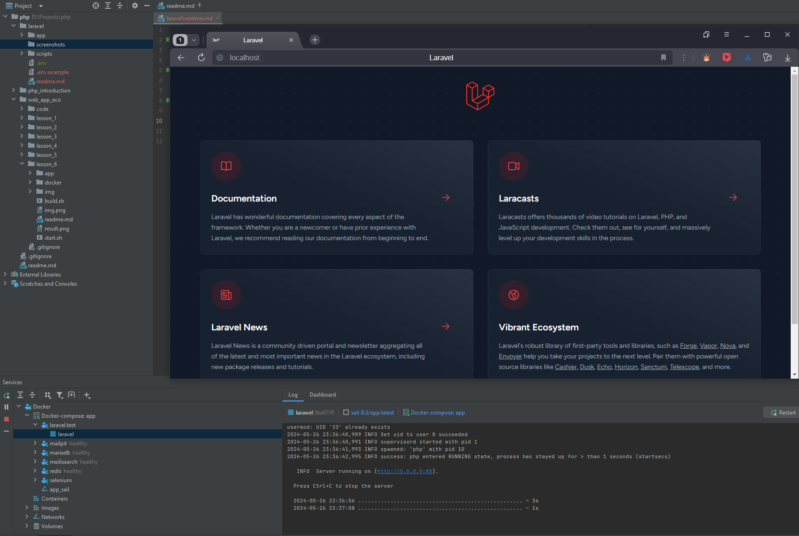
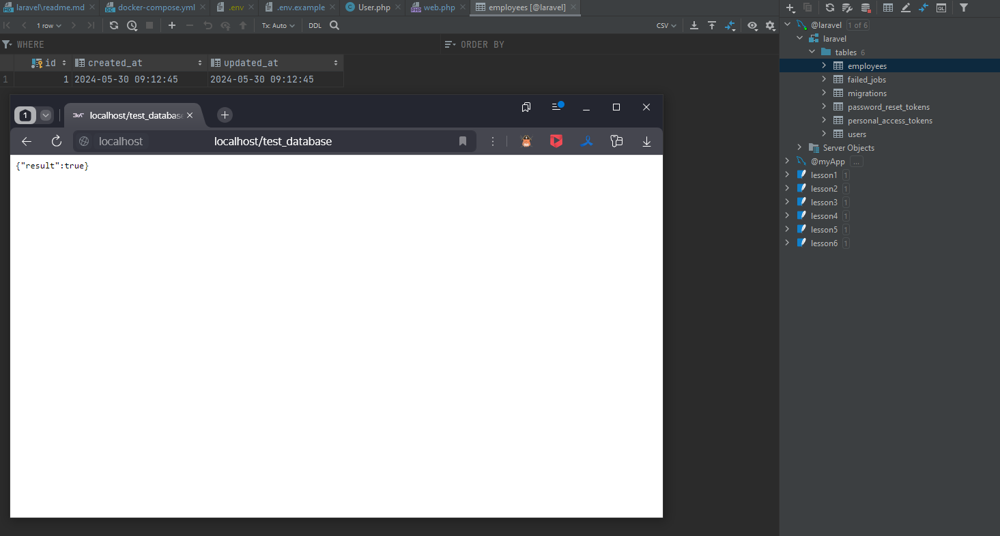
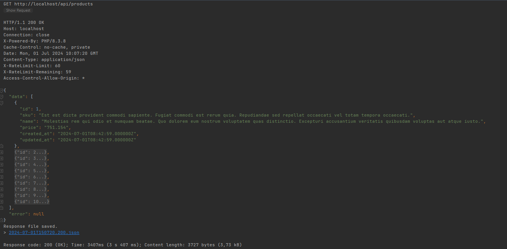
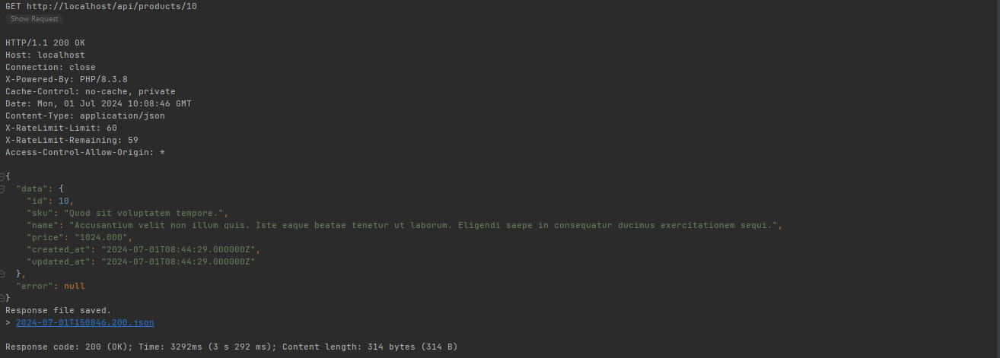
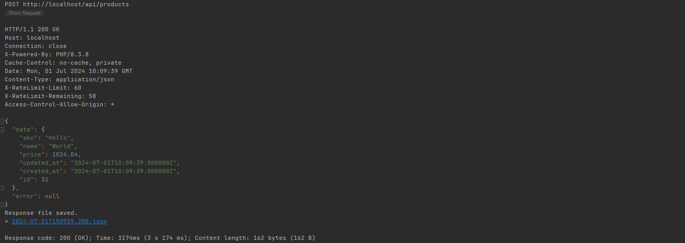
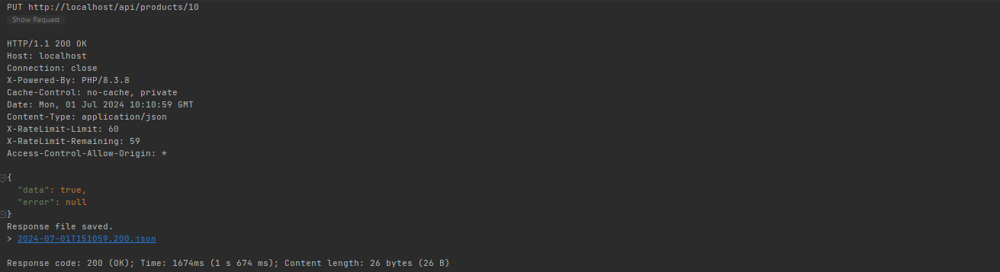
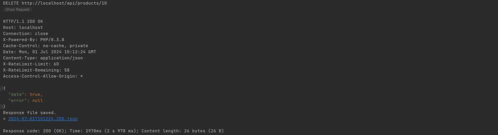

### Продвинутое программирование на PHP — Laravel

- Урок 1. Введение, установка и первичная настройка
- Урок 2. Контроллеры, экшены и роутинг
- Урок 3. Работа с базами данных. ORM-система Eloquent
- Урок 4. Работа с шаблонами. Шаблонизатор Blade
- Урок 5. Обработка запроса (Request)
- Урок 6. Работа с формами
- Урок 7. Формирование ответа (Response)
- Урок 8. Сервисы: создание и использование
- Урок 9. Работа с событиями
- Урок 10. Встроенные возможности Laravel
- Урок 11. Реализация авторизации
- Урок 12. Интеграция с внешними сервисами
- Урок 13. Тестирование и отладка Laravel-приложений
- Урок 14. Создание администраторской панели

#### DockerRun
```sh
sh scripts/build.sh && exit # Сборка проекта
```
```sh
sh scripts/start.sh && exit # Запуск проекта
```
```sh
sh scripts/stop.sh && exit # Остановка проекта
```
<details class="block"><summary>Docker mirrors</summary>

- Добавить зеркала для Docker (Windows: `%USERNAME%\.docker\daemon.json`)
```text
"registry-mirrors": [
    "https://huecker.io",
    "https://dockerhub.timeweb.cloud",
    "https://daocloud.io",
    "https://mirror.gcr.io"
]
```

</details>
<details class="block"><summary>Homeworks</summary>

- lesson 1
  
- lesson 2
  - ~~lesson_2 commit~~
- lesson 3
  
  - ~~lesson_3 commit~~
- lesson 4
  - ~~lesson_4 commit~~
- lesson 5
  - ~~lesson_5 commit~~
- lesson 6
  - ~~lesson_6 commit~~
- lesson 7
  - ~~lesson_7 commit~~
- lesson 8
  - ~~lesson_8 commit~~
- lesson 9
  - ~~lesson_9 commit~~
- lesson 10
  - ~~lesson_10 commit~~
    ```console
    php artisan queue:listen
    php artisan schedule:work
    ```
- lesson 11
  - ~~lesson_11 commit~~
    ```console
    docker exec -it laravel bash
    npm i
    nmp run build
    ```
- lesson 12
  - ~~lesson_12 commit~~
    ```console
    docker exec -it laravel bash
    npm i
    nmp run build
    ```
- lesson 13
  - ~~lesson_13 commit~~
    ```console
    docker exec -it laravel bash
    php artisan db:seed
    npm i
    nmp run build
    ```
  - Index: 
  - Show: 
  - Store: 
  - Update: 
  - Destroy: 
- lesson 14 (Промежуточная аттестация)
  - ~~lesson_14 commit~~
    ```console
    docker exec -it laravel bash
    php artisan db:seed
    npm i
    nmp run build
    ```

</details>